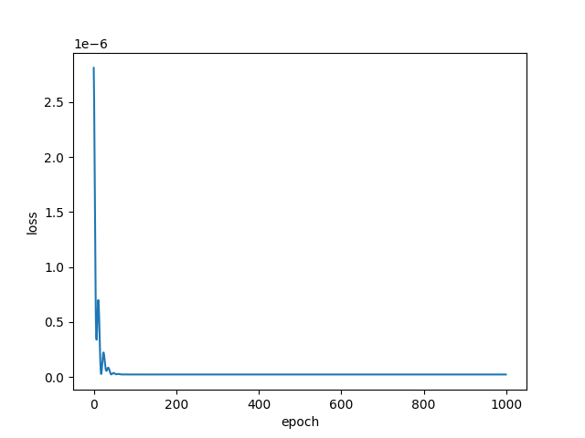
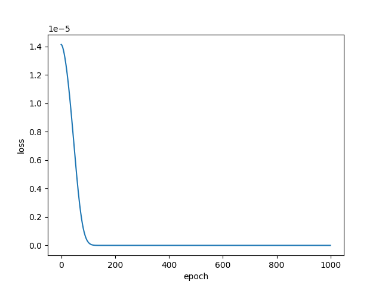
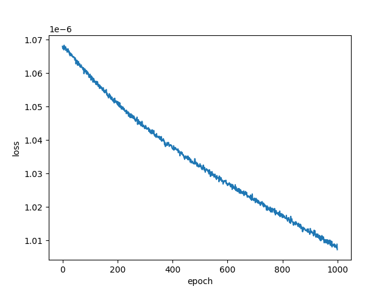
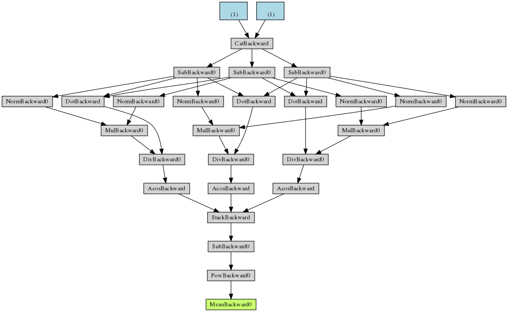

<h2></h2>
<div align="right">姓名：陳力宇&nbsp;&nbsp;&nbsp;&nbsp;學號：R08922069</div>
<h1 align="center">AR HW1</h1>

## Church's Algorithm

**實作方法：**

使用課堂提到的 church's algorithm，先計算出在 camera 那邊的三個角度當作目標，以 target A 作為原點，推算相機的 3D position。

我使用 OpenCV 處理圖片 I/O， PyTorch 處理偏微分的部分，選擇 MSE error function 和 SGD optimizer，learning rate 為 0.1，momentum 為 0.9

**使用方法：**

```bash
$ cd AR-registration
$ make
$ ./registration [image_path]
```

stdout 會出現：

1. A, B, C 三個 targets 在圖片的 pixel。
2. camera 側的三個角度
3. 最終的 loss
4. 以 A 作為原點，相機的 3D position (單位：m)
   以及 A 到相機的距離
5. 實際空間中的三個角度

## 三個範例的解答

### Short.png

```
B i: 633 j: 3513
A i: 1262 j: 466
C i: 2186 j: 2795

python started:

[camera] aob: 54.8971184912278
[camera] boc: 29.87286319715029
[camera] coa: 45.575761567873144

loss: 2.2992367e-08

Predicted camera position:
 o : [ 0.13486867 -0.02037901  0.26580256]
|o|: 0.2987572

[real] AOB: 54.89746755399223
[real] BOC: 29.865425912559942
[real] COA: 45.5626858625558
```



---

### Mid.png

```
B i: 672 j: 3550
A i: 1075 j: 1398
C i: 1747 j: 3000

python started:

[camera] aob: 39.02074466059489
[camera] boc: 20.56824107491574
[camera] coa: 32.7749578515174

loss: 1.045637e-09

Predicted camera position:
 o : [ 0.05924202 -0.02004514  0.377717  ]
|o|: 0.3828597

[real] AOB: 39.02251866338102
[real] BOC: 20.565573407041793
[real] COA: 32.77513039748553
```



---

### Long.png

```
B i: 1711 j: 2477
A i: 1842 j: 1687
C i: 2107 j: 2270

python started:

[camera] aob: 15.423733805386854
[camera] boc: 8.518047402746124
[camera] coa: 12.242616361667404

loss: 1.0072387e-06

Predicted camera position:
 o : [0.11507686 0.1253508  1.0327045 ]
|o|: 1.0466298

[real] AOB: 15.428033935817215
[real] BOC: 8.440291791915556
[real] COA: 12.304706528848572
```



---

#### PyTorch network



---

**開發環境**

- Ubuntu 18.04 on WSL
- OpenCV 4
- PyTorch 1.4.0
- NumPy 1.18.2
- Matplotlib 3.2.1
